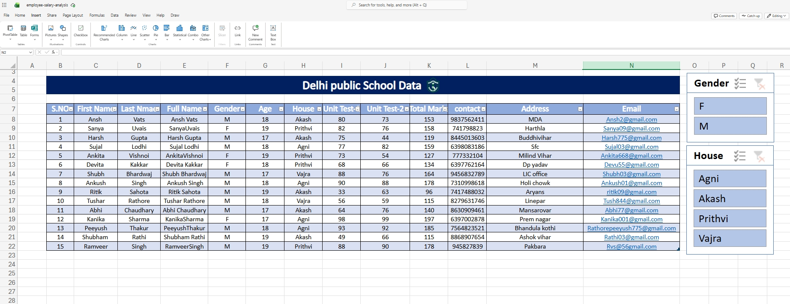
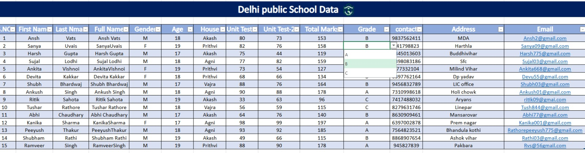
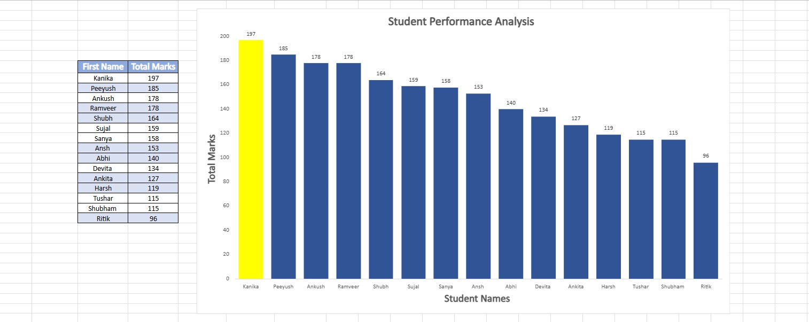

# Student Performance Analysis (Excel Project)

This project analyzes student performance data from Delhi Public School using Microsoft Excel. It focuses on organizing student records, calculating total marks, assigning grades, and visualizing performance through charts and filters.

# Project Overview

The dataset contains student details such as:
•Name and demographic information
•Gender and House classification
•Unit Test marks
•Total marks calculation
•Grade assignment based on performance

The project overview how excel can be used for analysis and visualization 

# Key Features

•Structured data using Excel Tables
•Automatic Total Marks calculation
•Grade assignment using formulas
•Interactive Slicers (Gender & House filters)
• Bar chart for student performance comparison

 # Tools & Skills Used

Microsoft Excel

Excel Tables

Formulas(sum,concatenate etc)

Charts & Visualizations

Slicers for interactivity

#  Files

student-performance-analysis.xlsx — 

> ⚠️ Note: GitHub does not support direct preview of Excel (.xlsx) files. Please download the Excel file to view.

🎯 Learning Outcome

Through this project, I practiced:

Real-world data organization

Using Excel formulas for analysis

Creating interactive dashboards

Presenting insights visually

## Preview

### Dataset Table

### Slicer

### Dropdown

### Chart

👤 Author

Peeyush Rathore
BCA Student | Aspiring Data Analyst
Learning Excel, SQL, and Python

---

⭐ If you find this project useful, feel free to star the repository!
